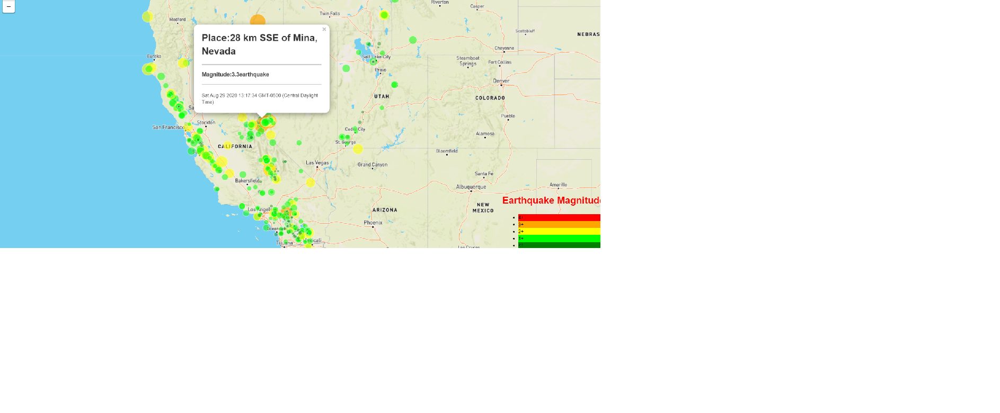
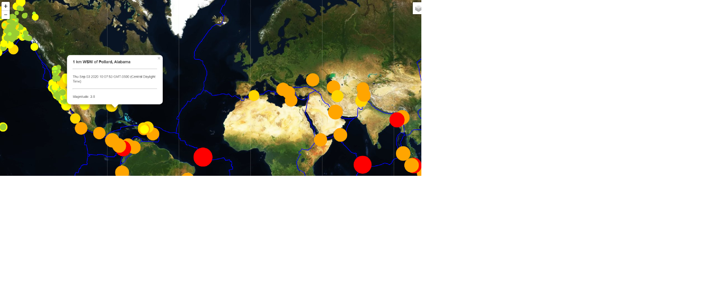

# Visualizing Data with Leaflet

## Background
#### Part1
In this project, a dashboard has to to be created in order to visualize the earthquakes occurring globally using a live API feed provided by the USGS(United States Geological Survey).

The data is sourced from U.S. Geological Survey (USGS) site, the USGS provides earthquake data in different formats, updated every 5 minutes. On the USGS GeoJSON Feed page and when we click on 'All Earthquakes from the Past 7 Days', it gives a JSON representation of that data.

The following steps are taken in order to create the visualization:

   Imported & Visualized the Data.

   Created a map using Leaflet that plots the earthquakes from data set based on their longitude and latitude.

   Data markers reflect the magnitude of the earthquake in their size and color. Earthquakes with higher magnitudes appear larger and darker in color.
   
   Included popups that provide additional information about the earthquake when a marker is clicked.

   Created a legend that will provide context for the map data.
   
   

#### Part2 
The USGS wants you to plot a second data set on your map to illustrate the relationship between tectonic plates and seismic activity. You will need to pull in a second data set and visualize it. Data on tectonic plates can be found at https://github.com/fraxen/tectonicplates.
In this step we are going to..

Plot a second data set on our map.

Add a number of base maps to choose from as well as separate out our two different data sets into overlays that can be turned on and off independently.

Add layer controls to our map.

 
